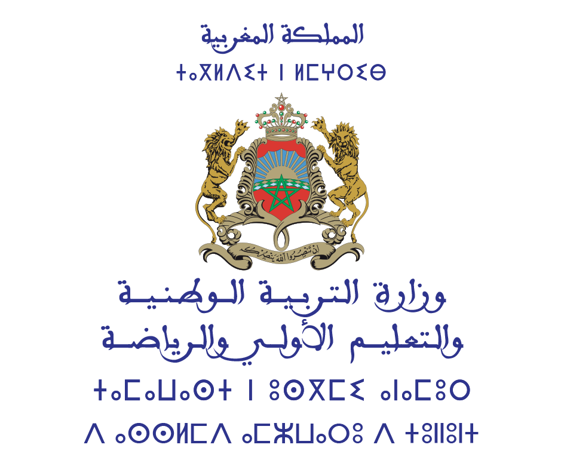

# Quick Draw Recognition - AI Sketch Detection

An AI-powered web application that recognizes hand-drawn sketches in real-time using deep learning models trained on Google's Quick Draw dataset.

<p align="center">
  
</p>

## Project Information

This project was developed as part of the **AI and PY Formation** program, a collaboration between:

- **Samsung Innovation Campus (SIC)**
- **Ministry of Education of Morocco** (Ministere de l'Education Nationale)

### Author

- **FAOUZI EL BAKRI** - Teacher

*Special thanks to AHMED LAMERI for his help*

---

## Features

- **Drawing Canvas** - Draw with mouse or touch, get real-time predictions
- **Camera Capture** - Use webcam to recognize drawings on whiteboard/paper
- **Image Upload** - Upload photos of drawings for recognition
- **340 Categories** - Recognizes 340 different objects from the Quick Draw dataset
- **Two Models**:
  - MobileNetV3 (17.7 MB) - Faster inference
  - EfficientNet-B2 (31.2 MB) - Higher accuracy

## Tech Stack

### Training
- Python
- PyTorch
- timm (PyTorch Image Models)
- OpenCV
- NumPy / Pandas

### Web Application
- Next.js 16
- TypeScript
- ONNX Runtime Web
- Tailwind CSS
- shadcn/ui
- Zustand

## Getting Started

### Prerequisites

- Node.js 18+
- pnpm
- Python 3.10+ (for model conversion)

### Installation

```bash
# Clone the repository
git clone <repository-url>
cd ai-project-draw-detection

# Install dependencies
pnpm install

# Copy ONNX Runtime files to public folder
cp node_modules/onnxruntime-web/dist/ort-wasm-simd-threaded*.wasm public/
cp node_modules/onnxruntime-web/dist/ort-wasm-simd-threaded*.mjs public/
```

### Model Conversion (if needed)

```bash
# Install Python dependencies
pip install torch timm onnx onnxruntime

# Convert PyTorch models to ONNX
python scripts/convert_to_onnx.py
```

### Run Development Server

```bash
pnpm dev
```

Open [http://localhost:3000](http://localhost:3000) in your browser.

### Build for Production

```bash
pnpm build --webpack
```

## Usage

1. Open the web application
2. Select a model (MobileNetV3 for speed, EfficientNet for accuracy)
3. Click **"Load Model"** to load the AI model
4. Choose your input method:
   - **Draw**: Draw on the canvas with mouse/finger
   - **Camera**: Capture from webcam
   - **Upload**: Upload an image file
5. View the top 5 predictions in real-time

## Project Structure

```
├── public/
│   ├── models/           # ONNX model files
│   ├── ministre.png      # Ministry of Education logo
│   └── ort-*.wasm/mjs    # ONNX Runtime Web files
├── scripts/
│   └── convert_to_onnx.py
├── src/
│   ├── app/              # Next.js app router
│   ├── components/       # React components
│   │   ├── quick-draw/   # Main app components
│   │   ├── explanation/  # Code explanation section
│   │   └── sharing/      # Share/code section
│   ├── hooks/            # Custom React hooks
│   ├── lib/              # Utilities and stores
│   └── services/         # Inference service
├── quick_draw_webcam.py  # Python webcam demo
├── quick_draw_demo.py    # Python demo script
└── quick-draw-recognition.ipynb  # Training notebook
```

## Training Notebook

The complete training notebook is available on Kaggle:

[Quick Draw Recognition Notebook](https://www.kaggle.com/code/faouzielbakri/quick-draw-recognition/notebook)

## Dataset

This project uses the [Google Quick Draw Dataset](https://quickdraw.withgoogle.com/data), which contains millions of doodles across 340 categories collected from the Quick, Draw! game.

## Acknowledgments

- **Samsung Innovation Campus** for the training program
- **Ministry of Education of Morocco** for the collaboration
- **Google** for the Quick Draw dataset
- **Hugging Face** for the timm library
- **ONNX Runtime** team for browser-based inference support

---

<p align="center">
  <strong>AI and PY Formation 2025</strong><br/>
  Samsung Innovation Campus x Ministry of Education of Morocco
</p>

<p align="center">
  Developed by <strong>FAOUZI EL BAKRI</strong>
</p>
